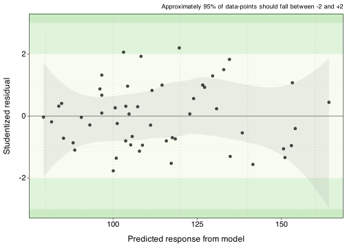

# lmPrettyPlot

Tiny R package for nice regression plots

## Installation

Version 0.1 of this package is currently available here on GitHub and
may be installed by:

``` r
library(remotes)
install_github("hgreatrex/lmPrettyPlot")
```

Or by using

``` r
library(devtools)
install_github("hgreatrex/lmPrettyPlot")
```

## Functions

### Studentized residual vs fits, lmplot_student_fits()

#### Example: Good linear fit. Diamonds from yarrr

``` r
library(lmPrettyPlots)
data("diamonds", package="yarrr")

lm.diamonds <- lm(value ~ weight, data = diamonds)
lmplot_student_fits(lm.diamonds)
```

<!-- -->

#### Example: Clear parabola

``` r
library(lmPrettyPlots)

# Create synthetic data
set.seed(42)
n <- 100
x <- seq(-5, 5, length.out = n)
y <- 3*x^2 - 5*x + 2 + rnorm(n, mean = 0, sd = 15)  # Quadratic with noise
df <- data.frame(x, y)

# output
model <- lm(y ~ x, data = df)
lmplot_student_fits(model)
```

    ## `geom_smooth()` using formula = 'y ~ x'

<!-- -->

#### Example: Weak quadratic

``` r
library(lmPrettyPlots)
data(mtcars)
model_mtcars <- lm(mpg ~ wt, data = mtcars)
lmplot_student_fits(model_mtcars)
```

<!-- -->

#### Example: Influential Outlier

``` r
library(lmPrettyPlots)
data("starwars",package="dplyr")
model_sw <- lm(height ~ mass, data = starwars)
lmplot_student_fits(model_sw)
```

<!-- -->

#### Example: Good linear fit

``` r
library(lmPrettyPlots)
data("HousesNY",package="Stat2Data")
model_house <- lm(Price ~ Size, data = HousesNY)
lmplot_student_fits(model_house)
```

<!-- -->

#### Example: Less good fit

``` r
library(lmPrettyPlots)
data("HousesNY",package="Stat2Data")
model_house <- lm(Price ~ Lot, data = HousesNY)
lmplot_student_fits(model_house)
```

<!-- -->

#### Anscombe’s quartet

As you can see, the code still isn’t perfect & need to tweak for use
with ggarrange. It also has one more smooth print message I need to
suppress.

``` r
library(lmPrettyPlots)
library(ggpubr)

data("anscombe")
model.1 <- lm(x1 ~ y1, data = anscombe)
model.2 <- lm(x2 ~ y2, data = anscombe)
model.3 <- lm(x3 ~ y3, data = anscombe)
model.4 <- lm(x4 ~ y4, data = anscombe)

p1 <- lmplot_student_fits(model.1)
p2 <- lmplot_student_fits(model.2)
p3 <- lmplot_student_fits(model.3)
p4 <- lmplot_student_fits(model.4)

ggarrange(p1,p2)
```

<!-- -->

``` r
ggarrange(p3,p4)
```

    ## Warning: Removed 1 row containing missing values or values outside the scale range
    ## (`geom_point()`).

<!-- -->
